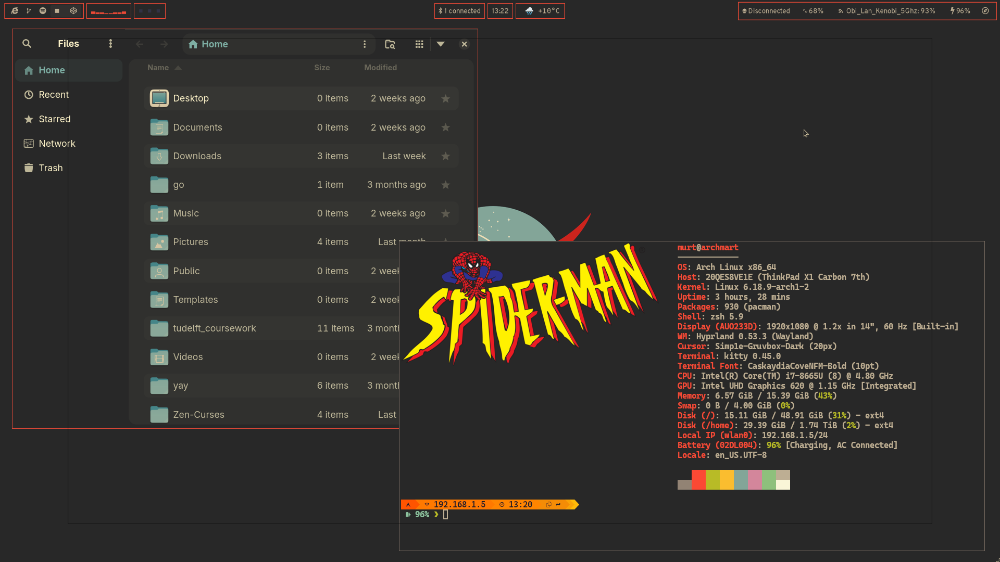
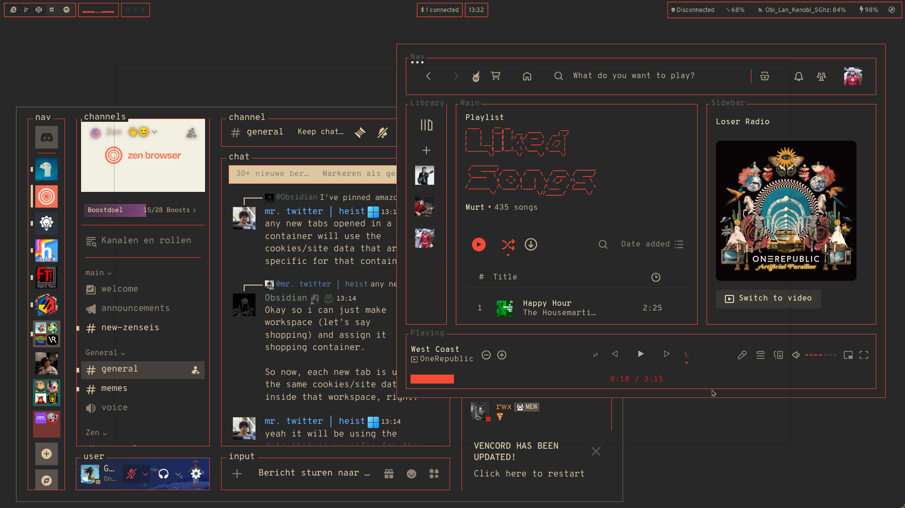

# Retro-Orange, an Gruvbox themed Hyprland setup





# Running the Desktop

You really only need the dotfiles required, if you have Hyprland:

```sh
# Clone desktop environment and checkout arch branch
git clone https://github.com/KingerNL/.dotfiles

# change into dotfiles directory
cd .dotfiles

# copy config files
cp -r config ../.config
```

# Programs (not in this repo):

- Browser/custom theme: I use [The Zen-browser](https://zen-browser.app/) with my own [custom theme](https://github.com/KingerNL/Zen-Curses)
- Discord custom theme: I use [Vesktop](https://vesktop.dev/) with my own custom color-scheme (not available at this moment)
- File Manager (Graphical): I use [Nautilus](https://archlinux.org/packages/extra/x86_64/nautilus/) with a custom gruvbox theme (not available at this moment)

