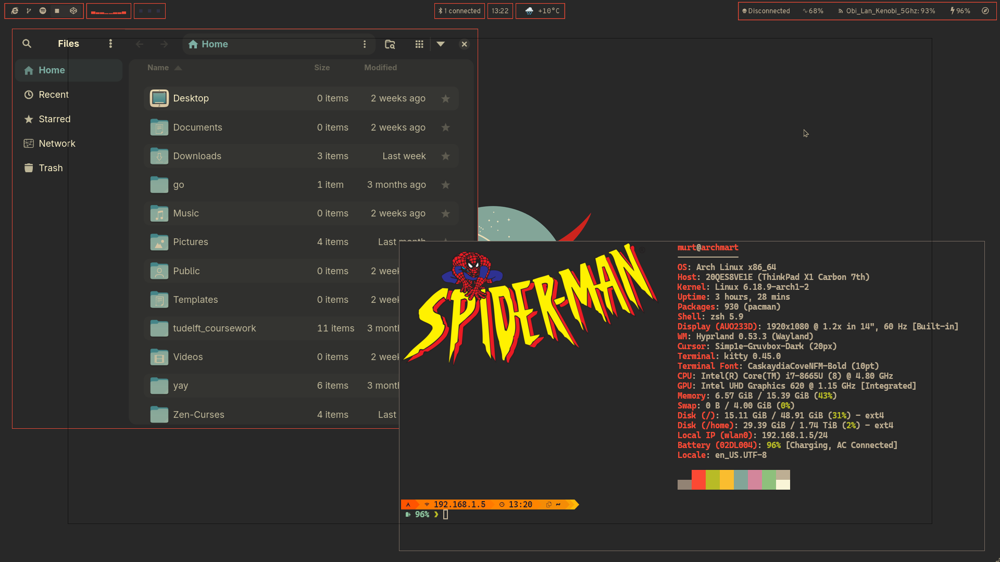
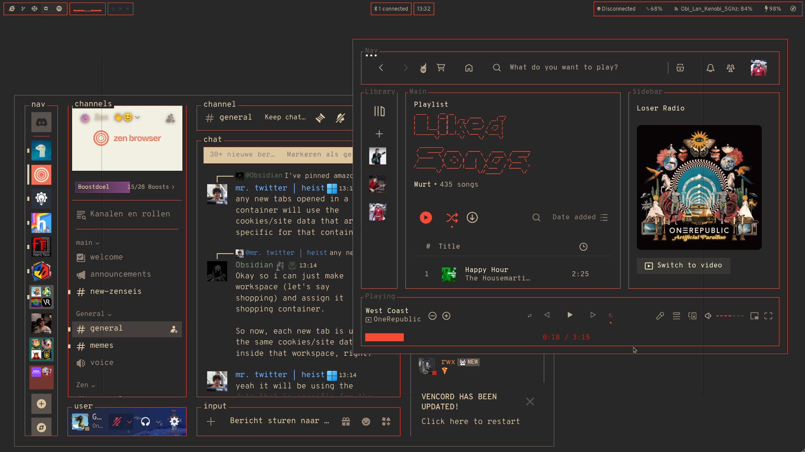

# Retro-Orange, a Gruvbox themed Hyprland setup




---

# Installation Guide

This guide assumes a fresh Arch Linux install. Everything is organized into **layers** - install what you need.

## Layer 1: Essentials (Recommended for everyone)

```sh
# Install base packages
sudo pacman -S --needed \
  hyprland waybar rofi dunst kitty starship systemd \
  git grim wl-clipboard playerctl bluez bluez-utils \
  networkmanager pipewire pipewire-pulse wireplumber \
  nerd-fonts

# Install yay (AUR helper)
git clone https://aur.archlinux.org/yay.git /tmp/yay && cd /tmp/yay && makepkg -si

# Install essential AUR packages
yay -S zen-browser nautilus
```

## Layer 2: Shell & Terminal

```sh
# Install zsh essentials
sudo pacman -S zsh lsd fastfetch
yay -S zsh-autosuggestions zsh-syntax-highlighting

# Install oh-my-zsh
sh -c "$(curl -fsSL https://raw.githubusercontent.com/ohmyzsh/ohmyzsh/master/tools/install.sh)"

# Copy zsh config
cp .zshrc ~

# Install starship (prompt)
sudo pacman -S starship

# Copy starship config
mkdir -p ~/.config/starship
cp config/starship/starship.toml ~/.config/starship/
```

## Layer 3: Per-Component Extras

Install only what you want to use:

| Component | Command |
|-----------|---------|
| **waybar** | `sudo pacman -S cava nordvpn curl` |
| **nvim** | `sudo pacman -S git cargo nodejs npm` |
| **kitty font** | `yay -S ttf-caskaydia-cove-nerd` |
| **hyprland extras** | `sudo pacman -S hyprlock hyprpicker hyprshot satty swww` |

## Copy Configs

```sh
# Copy all configs
cp -r config/* ~/.config/

# Install cursor theme
mkdir -p ~/.local/share/icons
tar -xf cursor_theme/Simp1e-Gruvbox-Dark.tar.xz -C ~/.local/share/icons/

# Install fonts
fc-cache -fv
```

---

# Optional Programs

Not included in the install scripts - install manually if wanted:

| Program | Install |
|---------|---------|
| Zen Browser | `yay -S zen-browser` |
| Vesktop (Discord) | `yay -S vesktop` |
| Spicetify | `yay -S spicetify-cli` |
| Steam | `sudo pacman -S steam` |

---

# Package Reference

- **requirements-base.txt** - Core packages (hyprland, waybar, rofi, etc.)
- **requirements-aur.txt** - AUR packages (yay, zen-browser, vesktop, nautilus)
- **config/*/requirements.txt** - Per-component extras

---

# Programs Used (not in this repo)

- Browser: [Zen Browser](https://zen-browser.app/) with [custom theme](https://github.com/KingerNL/Zen-Curses)
- Discord: [Vesktop](https://vesktop.dev/) with custom Gruvbox theme
- File Manager: [Nautilus](https://archlinux.org/packages/extra/x86_64/nautilus/)
